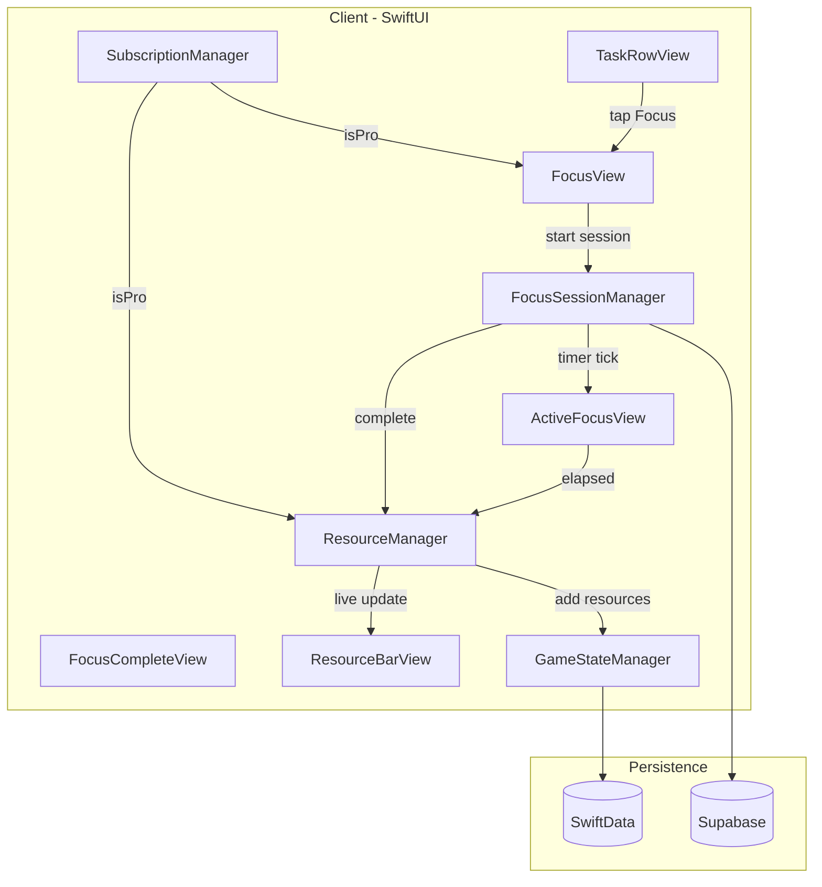

# GameFi Focus Mode: Implementation Plan

*PRD + Architecture + TechStack for integrating the Town Builder gamification into Docket*  
*References: [GAMEFI_FOCUS_CONCEPT.md](GAMEFI_FOCUS_CONCEPT.md) (what we're building) | [GAMEFI_FOCUS_TODO.md](GAMEFI_FOCUS_TODO.md) (step-by-step tasks)*

---

## 1. Product Requirements (PRD)

### 1.1 User Stories

#### Phase 1 — Focus Mode MVP

- **US1.1** As a user, I can tap a Focus button on the progress slider row to enter a full-screen focus zone.
- **US1.2** As a user, I can set a timer duration in 15-min steps (15–120 min) via a "+" button; holding accelerates.
- **US1.3** As a user, I can pick one resource to gather during a focus session (Wood, Iron, Gold, Food, Stone).
- **US1.4** As a user, I can see a breathing progress ring and countdown timer while the session runs.
- **US1.5** As a user, I can see resources accumulate live during the session (top bar + "+N of X" counter).
- **US1.6** As a user, I can pause or cancel a session; cancelling applies a 75% penalty to earned resources.
- **US1.7** As a user, I can see my streak (consecutive days) and daily focus minutes on the focus screen.
- **US1.8** As a user, I can optionally mark the associated task complete when the session ends.
- **US1.11** As a user, I receive a sound or haptic alarm when the timer reaches 0 (respects phone settings).
- **US1.9** As a Pro subscriber, I can pick two resources per session and gather at 2x rate.
- **US1.10** As a free user, I can use voice-to-task 5 times per month; Pro users get unlimited.

#### Phase 2 — Town Grid

- **US2.1** As a user, I can view a grid of my town with buildings (emoji-based).
- **US2.2** As a user, I can tap an empty tile to build a structure (Hut, Farm, Lumber Mill, Mine, Warehouse, Barracks, Castle).
- **US2.3** As a user, I can upgrade buildings up to the Castle level; Castle requires Warehouse + population.
- **US2.4** As a user, I can collect passive building income when I open the app.
- **US2.5** As a user, I can manage population via housing and food; food deficit causes population decline.
- **US2.6** As a user, I can access Game Settings (notifications, leaderboard visibility) from Profile.

#### Phase 3 — Social + Prestige

- **US3.1** As a user, I can view a leaderboard (public or friends-only) and see my rank.
- **US3.2** As a user, I can tap a player to view their town (read-only).
- **US3.3** As a Pro user, I can set a custom town name.
- **US3.4** As a user, I can earn achievements for milestones and receive bonus resources.
- **US3.5** As a user, I can build Barracks and recruit army units (prestige only).

#### Phase 4 — Exploration

- **US4.1** As a user, I can explore a world map and discover tiles.
- **US4.2** As a user, I can engage in auto-battle PvE for bonus resources.
- **US4.3** As a user, I can enable ambient music during focus sessions.

---

### 1.2 Acceptance Criteria

| Feature | Acceptance Criteria |
|---------|---------------------|
| **Focus button** | Visible only when `task.isProgressEnabled` and slider is open; appears at right end of row; tap opens full-screen focus view |
| **Timer picker** | 15-min steps, "+" button, hold to accelerate; min 15, max 120 min; default 30 |
| **Completion alarm** | Sound or haptic when timer reaches 0; respect silent mode / ringer / haptics settings |
| **Resource selection** | 5 types; shows estimated yield; Pro users can pick 2 resources |
| **Live accumulation** | Top bar updates every ~5s; "+N of X" counter visible; accumulation stops on pause/cancel/complete |
| **Breathing ring** | Ring fills proportionally to elapsed time; subtle pulse animation when active |
| **Parallax background** | Pixel art layers scroll right-to-left at different speeds; tileable, no seams |
| **Incomplete penalty** | Cancelled session: 75% of earned resources; message shown on complete view |
| **Streak** | Consecutive days; displayed on focus screen; resets on missed day; Pro: 1 miss/week forgiven |
| **1hr bonus** | After 60 min focus in a day, +25% rate for rest of day |
| **Storage caps** | Excess resources lost when at cap; notification when full |
| **Pro subscription** | StoreKit 2; `isPro` gates 2x rate, 2 resources, unlimited sessions, voice tasks |
| **Voice gating** | Free: 5/month; counter in `user_game_state`; reset on calendar month change |

---

### 1.3 Feature Gates (Free vs Pro)

| Gate | Enforcement Point |
|------|-------------------|
| 2x gathering rate | `ResourceManager.effectiveRate(isPro:)` |
| 2 resources per session | `FocusView` resource picker; disable second pick when `!isPro` |
| Unlimited daily sessions | `FocusSessionManager.canStartSession()` — free: max 10/day |
| Streak protection | `GameStateManager.streakProtectionUsed` — Pro: 1/week |
| +50% storage caps | `ResourceManager.storageCap(for:)` |
| Barracks, Castle Lv3 | `GameStateManager.canBuild()` — Pro only |
| Custom town name | `GameSettingsView` — edit disabled when `!isPro` |
| Leaderboard rank | `LeaderboardView` — free: view only; Pro: full rank display |
| Unlimited voice tasks | `VoiceTaskParser` — check `voiceTasksUsedThisMonth < 5` before calling Edge Function |

---

### 1.4 Voice-to-Task Subscription Gating

- **Where to track:** `user_game_state.voice_tasks_used_this_month`, `voice_tasks_reset_date`
- **When to increment:** On successful `ParseResponse` with `type == "complete"` (user accepted tasks)
- **When to reset:** On app launch or first API call of new calendar month — compare `voice_tasks_reset_date` to current month; if different, set `voice_tasks_used_this_month = 0`, `voice_tasks_reset_date = now()`
- **Enforcement:** In `VoiceTaskParser.parse()`, before calling Edge Function: if `!isPro && voiceTasksUsedThisMonth >= 5`, return early with error "Voice tasks limit reached. Upgrade to Pro for unlimited."
- **Edge Function:** No change needed — client decides whether to call; server can optionally enforce via `user_game_state` if we add server-side check later

---

## 2. Architecture (ARD)

### 2.1 Data Flow



---

### 2.2 New SwiftData Models

| Model | Purpose | Key Properties |
|-------|---------|----------------|
| **GameState** | Singleton per user | `userId`, `wood`, `iron`, `gold`, `food`, `stone`, `streakDays`, `streakLastDate`, `streakProtectedThisWeek`, `townLevel`, `townName`, `population`, `dailyFocusMinutes`, `dailyFocusDate`, `leaderboardVisibility`, `gameNotificationsEnabled`, `voiceTasksUsedThisMonth`, `voiceTasksResetDate`, `syncStatus` |
| **Building** | Per-tile building | `userId`, `buildingType`, `level`, `gridX`, `gridY`, `createdAt`, `updatedAt`, `syncStatus` |
| **FocusSession** | Per-session record | `userId`, `taskId` (optional), `resourceType`, `durationSeconds`, `earnedAmount`, `isCompleted`, `startedAt`, `completedAt`, `syncStatus` |
| **Achievement** | Per-achievement unlock | `userId`, `achievementType`, `unlockedAt`, `claimed`, `syncStatus` |

**SwiftData schema:** Register all four in `ModelContainer` in `DocketApp.swift`. Use `@Attribute(.unique)` for `GameState.userId` (singleton).

---

### 2.3 New Managers

| Manager | Responsibilities |
|---------|------------------|
| **FocusSessionManager** | Timer logic (countdown, pause/resume), live accumulation tick (~5s), session lifecycle (start/complete/cancel), streak update, 1hr bonus check, incomplete penalty |
| **ResourceManager** | Resource CRUD, storage cap enforcement, `effectiveRate()` (Pro + bonus + streak), passive income calculation (Phase 2), food maintenance (Phase 2) |
| **GameStateManager** | Town level, population, building prerequisites (Castle cap, Warehouse + pop for Castle), streak tracking, achievement unlock, `canBuild()`, `canUpgrade()` |
| **SubscriptionManager** | StoreKit 2 product load, purchase flow, receipt validation, `isPro` published property, restore purchases |

---

### 2.4 New Views (Phase 1)

| View | Purpose |
|------|---------|
| **FocusView** | Pre-session: timer picker (15/30/45), resource picker (5 types, Pro: 2), streak display, resource bar, Start button |
| **ActiveFocusView** | Running: parallax background, breathing ring, countdown, live "+N of X" counter, Cancel/Pause |
| **FocusCompleteView** | Results: earned resources, streak status, daily total, "Mark task complete?" prompt, Back to Tasks |
| **FocusBreathingRing** | Reusable large ring (distinct from small `ProgressRing`); progress arc + breathing pulse when active |
| **ParallaxBackground** | Tileable pixel art layers; `TimelineView`-driven offset animation; 4 layers + cloud overlay |
| **ResourceBarView** | Horizontal bar: 5 resource icons + counts; tap for detail; reusable in Focus + Town |

---

### 2.5 Integration with Existing Code

| File | Change |
|------|--------|
| `TaskRowView.swift` | Add Focus button (`scope` or `flame.fill`) at right end of `ProgressSlider` row (line ~174); pass `onFocus: { ... }` to present `FocusView` as full-screen cover |
| `ProfileView.swift` | Add "Game Settings" section: notifications toggle, leaderboard visibility, town name (Pro), reset progress |
| `VoiceTaskParser.swift` | Inject `GameStateManager` or `ResourceManager`; before `parse()` call, check `voiceTasksUsedThisMonth`; after success, increment counter |
| `SyncEngine.swift` | Add `pushGameState()`, `pullGameState()`, `pushFocusSessions()`, `pullFocusSessions()`; extend `ModelContext` schema for new models |
| `DocketApp.swift` | Add `@StateObject` for `FocusSessionManager`, `ResourceManager`, `GameStateManager`, `SubscriptionManager`; inject via `.environmentObject()` |

---

## 3. Database Schema (Supabase)

### 3.1 Migration 013: GameFi Focus Tables

```sql
-- ============================================================
-- GameFi Focus Mode Tables
-- ============================================================

-- user_game_state: singleton per user
CREATE TABLE IF NOT EXISTS public.user_game_state (
  id uuid PRIMARY KEY DEFAULT gen_random_uuid(),
  user_id uuid NOT NULL REFERENCES auth.users(id) ON DELETE CASCADE UNIQUE,
  wood integer NOT NULL DEFAULT 0,
  iron integer NOT NULL DEFAULT 0,
  gold integer NOT NULL DEFAULT 0,
  food integer NOT NULL DEFAULT 0,
  stone integer NOT NULL DEFAULT 0,
  streak_days integer NOT NULL DEFAULT 0,
  streak_last_date date,
  streak_protected_this_week boolean NOT NULL DEFAULT false,
  town_level integer NOT NULL DEFAULT 1,
  town_name text,
  population integer NOT NULL DEFAULT 0,
  daily_focus_minutes integer NOT NULL DEFAULT 0,
  daily_focus_date date,
  leaderboard_visibility text NOT NULL DEFAULT 'hidden' CHECK (leaderboard_visibility IN ('public', 'friends_only', 'hidden')),
  game_notifications_enabled boolean NOT NULL DEFAULT true,
  voice_tasks_used_this_month integer NOT NULL DEFAULT 0,
  voice_tasks_reset_date date,
  created_at timestamptz NOT NULL DEFAULT now(),
  updated_at timestamptz NOT NULL DEFAULT now()
);

CREATE INDEX idx_user_game_state_user_id ON public.user_game_state(user_id);

-- focus_sessions: per session
CREATE TABLE IF NOT EXISTS public.focus_sessions (
  id uuid PRIMARY KEY DEFAULT gen_random_uuid(),
  user_id uuid NOT NULL REFERENCES auth.users(id) ON DELETE CASCADE,
  task_id uuid REFERENCES public.tasks(id) ON DELETE SET NULL,
  resource_type text NOT NULL CHECK (resource_type IN ('wood', 'iron', 'gold', 'food', 'stone')),
  duration_seconds integer NOT NULL,
  earned_amount integer NOT NULL,
  is_completed boolean NOT NULL DEFAULT false,
  started_at timestamptz NOT NULL DEFAULT now(),
  completed_at timestamptz,
  created_at timestamptz NOT NULL DEFAULT now()
);

CREATE INDEX idx_focus_sessions_user_id ON public.focus_sessions(user_id);
CREATE INDEX idx_focus_sessions_started_at ON public.focus_sessions(started_at);

-- buildings: per building (Phase 2)
CREATE TABLE IF NOT EXISTS public.buildings (
  id uuid PRIMARY KEY DEFAULT gen_random_uuid(),
  user_id uuid NOT NULL REFERENCES auth.users(id) ON DELETE CASCADE,
  building_type text NOT NULL CHECK (building_type IN ('hut', 'farm', 'lumber_mill', 'mine', 'warehouse', 'barracks', 'castle')),
  level integer NOT NULL DEFAULT 1,
  grid_x integer NOT NULL,
  grid_y integer NOT NULL,
  created_at timestamptz NOT NULL DEFAULT now(),
  updated_at timestamptz NOT NULL DEFAULT now(),
  UNIQUE(user_id, grid_x, grid_y)
);

CREATE INDEX idx_buildings_user_id ON public.buildings(user_id);

-- achievements: per user achievement (Phase 3)
CREATE TABLE IF NOT EXISTS public.achievements (
  id uuid PRIMARY KEY DEFAULT gen_random_uuid(),
  user_id uuid NOT NULL REFERENCES auth.users(id) ON DELETE CASCADE,
  achievement_type text NOT NULL,
  unlocked_at timestamptz NOT NULL DEFAULT now(),
  claimed boolean NOT NULL DEFAULT false,
  UNIQUE(user_id, achievement_type)
);

CREATE INDEX idx_achievements_user_id ON public.achievements(user_id);

-- RLS
ALTER TABLE public.user_game_state ENABLE ROW LEVEL SECURITY;
ALTER TABLE public.focus_sessions ENABLE ROW LEVEL SECURITY;
ALTER TABLE public.buildings ENABLE ROW LEVEL SECURITY;
ALTER TABLE public.achievements ENABLE ROW LEVEL SECURITY;

-- user_game_state: own data only
CREATE POLICY "Users can manage own game state" ON public.user_game_state
  FOR ALL USING (auth.uid() = user_id) WITH CHECK (auth.uid() = user_id);

-- focus_sessions: own data only
CREATE POLICY "Users can manage own focus sessions" ON public.focus_sessions
  FOR ALL USING (auth.uid() = user_id) WITH CHECK (auth.uid() = user_id);

-- buildings: own data only
CREATE POLICY "Users can manage own buildings" ON public.buildings
  FOR ALL USING (auth.uid() = user_id) WITH CHECK (auth.uid() = user_id);

-- achievements: own data only
CREATE POLICY "Users can manage own achievements" ON public.achievements
  FOR ALL USING (auth.uid() = user_id) WITH CHECK (auth.uid() = user_id);

-- Realtime (optional, for cross-device sync)
ALTER PUBLICATION supabase_realtime ADD TABLE public.user_game_state;
```

---

### 3.2 Migration 014: Leaderboard (Phase 3)

```sql
-- Leaderboard: computed view for ranking
-- Scoring: (town_level * 100) + (total_buildings * 10) + (population * 5) + (army_size * 3) + total_focus_minutes
CREATE OR REPLACE FUNCTION public.leaderboard_scores(
  p_visibility text DEFAULT 'public',
  p_user_id uuid DEFAULT NULL  -- for friends_only: filter to contacts
)
RETURNS TABLE (
  user_id uuid,
  town_name text,
  town_level integer,
  population integer,
  army_size integer,
  total_focus_minutes bigint,
  score bigint,
  rank bigint
) AS $$
  -- Implementation: join user_game_state, buildings, focus_sessions
  -- Filter by leaderboard_visibility; for friends_only, join contacts
  -- Order by score DESC, assign rank
$$ LANGUAGE plpgsql SECURITY DEFINER;
```

---

### 3.3 Server-Authoritative Resource Grant

To prevent cheating, resource grants should be validated server-side:

- **Option A:** Edge Function `complete-focus-session` — client sends `{ sessionId, durationSeconds, resourceType }`; server validates duration, computes earned amount, updates `user_game_state`
- **Option B:** Client computes and writes; server trigger validates `earned_amount` vs. `duration_seconds` and `resource_type` (rate tables in DB)

Recommendation: **Option A** for Phase 1 — simpler and more secure. Client shows live accumulation for UX; on complete, client calls Edge Function with session data; server does the final grant.

---

## 4. Tech Stack Decisions

| Decision | Choice | Rationale |
|----------|--------|------------|
| **Subscription** | StoreKit 2 | Native, async/await, `Product.SubscriptionInfo` for status |
| **Local persistence** | SwiftData | Aligns with existing Task, GroceryStore; offline-first |
| **Live accumulation** | `TimelineView(.animation)` | Built-in, no extra deps; ~5s tick for battery |
| **Parallax** | Layered `Image` + `offset` | Simpler than Canvas; tileable PNGs |
| **Pixel art** | `Assets.xcassets` | @1x/@2x/@3x; no external asset loader |
| **Backend** | Supabase only | No new services; reuse Auth, DB, Edge Functions |
| **Anti-cheat** | Edge Function | Validate session on server before granting resources |

---

## 5. Anti-Cheat Considerations

- **Session validation:** Server checks `duration_seconds` vs. max for selected timer (15/30/45 min)
- **Rate limiting:** Max 1 session completion per 14 minutes (prevents rapid fake sessions)
- **Resource write:** Only server writes to `user_game_state` on session complete; client never directly increments
- **Streak:** Server can validate `streak_last_date` continuity on pull; client is source of truth for display, server for persistence

---

## Cross-References

- **What we're building:** [GAMEFI_FOCUS_CONCEPT.md](GAMEFI_FOCUS_CONCEPT.md)
- **Step-by-step tasks:** [GAMEFI_FOCUS_TODO.md](GAMEFI_FOCUS_TODO.md)
- **Economy numbers:** [GAMEFI_BALANCE_SHEET.md](GAMEFI_BALANCE_SHEET.md)
