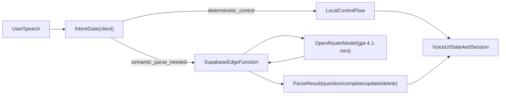

# Voice-to-Task V2 Architecture Plan

## Overview

Docket's voice assistant is a **conversational AI** — users speak naturally and the assistant talks back, asks for missing details, and confirms before saving. It adapts to how much context the user provides: say everything at once and it creates the task immediately; say just a title and it asks follow-up questions.

The system transcribes speech on-device (Apple SFSpeechRecognizer), sends conversation history to a cloud AI (gpt-4.1-mini via Supabase Edge Function), and receives either a follow-up question or completed task(s). TTS reads responses aloud so the user can interact hands-free. The next evolution is a **personalization adaptation loop** that learns each user's words, expressions, and habits from corrections and editing patterns.

---

## User Experience Flow

### Conversational Flow (partial info → AI asks follow-ups)
```
1. Tap mic button
2. User:  "Add a task"
3. AI:    "Sure, what do you need to do?" (TTS + text bubble)
4. User:  "Call Mom"
5. AI:    "When is it due?" (TTS + text bubble)
6. User:  "Tomorrow"
7. AI:    "Any notes or want to share it with someone?" (TTS + text bubble)
8. User:  "Yeah, note she wants to talk about the trip. Share with Sarah."
9. AI:    "Call Mom, tomorrow, high priority. Note: weekend trip.
          Sharing with Sarah. Want me to add it?" (TTS + preview card)
10. User: "Yes" (voice or tap)
11. Task saved + share created
```

### Power User Flow (everything at once → instant creation)
```
1. Tap mic button
2. User:  "Call Mom tomorrow, it's important, note that she wants to
          talk about the weekend trip, and share it with Sarah"
3. AI:    "Call Mom, tomorrow, high priority. Noted: weekend trip.
          Sharing with Sarah. Adding it now." (TTS + preview card)
4. User:  "Sounds good" (voice or tap)
5. Task saved + share created
```

### Batch Dictation
```
1. Tap mic button
2. User:  "I need to email the client by Friday, pick up groceries
          after work, and schedule a dentist appointment next week"
3. AI:    "3 tasks: Email client by Friday, groceries today, and
          dentist next week. Want me to add all three?" (TTS + preview list)
4. User:  "Add all" (voice or tap)
5. All tasks saved
```

### Correction Flow
```
1. (After AI reads back a task summary)
2. User:  "Actually make it Wednesday, not tomorrow"
3. AI:    "Updated — Call Mom on Wednesday. Anything else?"
4. User:  "No, add it"
5. Task saved with corrected date
```

### Key UX Principles
- **Adaptive:** If the user gives everything, skip questions. If partial, ask one question at a time.
- **Brief responses:** AI speaks 1-2 sentences max per turn (it's read aloud — long responses are annoying).
- **Mic auto-restarts:** After TTS finishes speaking, the mic re-activates automatically so the user can respond hands-free.
- **Visual + audio:** Every AI response appears as text AND is spoken via TTS. User can mute TTS in Settings.

### Synchronized text + audio (v1.1)
Assistant responses use streaming TTS for low latency:
- Text is revealed immediately; TTS streams PCM audio from OpenAI gpt-4o-mini-tts via Edge Function.
- Playback starts as soon as the first chunks arrive (AVAudioEngine + AVAudioPlayerNode).
- "Preparing voice..." shows while the stream is connecting; playback begins within ~0.5–1.5 s.
- On stream error or timeout, the app falls back to Apple TTS.

### Interruption policy
- **`.began`** (e.g. phone call, Siri): recording is stopped; no auto-resume.
- **`.ended`**: the view sets `shouldResumeAfterInterruption` when it is in the listening flow and not speaking. The speech manager resumes listening only when that flag is true, avoiding double-start or resume during TTS.

### Latency-first intent routing
To keep voice turns fast, Docket uses a hybrid split:
- **Client-side (instant, deterministic):** UI/session control intents such as dismiss phrases, gratitude acknowledgments, mic/session handoffs, and rendering-state guardrails.
- **Edge Function + model (network/AI):** semantic task understanding and extraction (`question`, `complete`, `update`, `delete`) from natural language.
- **Rule of thumb:** if an intent can be resolved deterministically without AI, handle it locally and skip the parser round-trip.
- **When to move server-side:** only for cross-platform policy consistency, analytics/A-B testing, or behavior changes that must ship without an app release.

**Implementation:** The client-side intent gate is `IntentClassifier` (`Managers/IntentClassifier.swift`). It returns `VoiceIntent` (confirm, reject, dismiss, gratitude, taskRequest). `VoiceRecordingView` dispatches on this result; only `.taskRequest` goes to the Edge Function. See VOICE-INTENT-RULES.md and ADR-009.



---

## Technical Architecture

```
┌─────────────────────────────────────────────┐
│              Docket iOS App                  │
│                                             │
│  ┌───────────────────────────────────────┐  │
│  │        Conversation Loop              │  │
│  │                                       │  │
│  │  ┌─────────────┐  ┌───────────────┐  │  │
│  │  │ Mic Button  │  │ messages[]    │  │  │
│  │  │ Voice UI    │  │ (state)       │  │  │
│  │  └──────┬──────┘  └───────────────┘  │  │
│  │         │                             │  │
│  │  ┌──────▼──────────────────────────┐  │  │
│  │  │ SFSpeechRecognizer (on-device)  │  │  │
│  │  │ → transcribes user speech       │  │  │
│  │  └──────┬──────────────────────────┘  │  │
│  │         │ user text                   │  │
│  │         │ appended to messages[]      │  │
│  │  ┌──────▼──────────────────────────┐  │  │
│  │  │ Supabase Client (HTTPS POST)    │  │  │
│  │  │ sends full messages[] + context │  │  │
│  │  └──────┬──────────────────────────┘  │  │
│  └─────────┼─────────────────────────────┘  │
└────────────┼────────────────────────────────┘
             │ HTTPS
             │
┌────────────▼────────────────────────────────┐
│      Supabase Edge Function                  │
│      "parse-voice-tasks"                     │
│                                              │
│  Receives: { messages[], today, timezone,     │
│             existingTasks[], groceryStores[] }│
│  Forwards to OpenRouter (gpt-4.1-mini)       │
│  Returns one of:                             │
│    → { type: "question", text: "..." }       │
│    → { type: "complete", tasks: [...],       │
│        summary: "..." }                      │
│    → { type: "update", taskId: "...",        │
│        changes: {...}, summary: "..." }      │
│    → { type: "delete", taskId: "...",        │
│        summary: "..." }                      │
└────────────┬────────────────────────────────┘
             │ JSON response
             │
┌────────────▼────────────────────────────────┐
│              Docket iOS App                  │
│                                              │
│  ┌────────────────────────────────────────┐  │
│  │ if type == "question":                 │  │
│  │   → TTS speaks the question            │  │
│  │   → Text bubble shown in Voice UI      │  │
│  │   → Append to messages[]               │  │
│  │   → Mic auto-restarts after TTS done   │  │
│  │   → LOOP BACK (user speaks again)      │  │
│  │                                        │  │
│  │ if type == "complete":                 │  │
│  │   → TTS speaks the summary             │  │
│  │   → TaskConfirmationView shown         │  │
│  │   → User confirms (voice or tap)       │  │
│  │   → Save to SwiftData → sync           │  │
│  │   → Resolve shares if needed           │  │
│  │                                        │  │
│  │ if type == "update":                   │  │
│  │   → Match task by taskId in SwiftData  │  │
│  │   → Apply changes (title/date/etc.)    │  │
│  │   → TTS speaks summary                 │  │
│  │   → Sync updated task                  │  │
│  │                                        │  │
│  │ if type == "delete":                   │  │
│  │   → Match task by taskId in SwiftData  │  │
│  │   → Delete task + TTS confirmation     │  │
│  └────────────────────────────────────────┘  │
└──────────────────────────────────────────────┘
```

### Conversation Loop (pseudocode)
```swift
var messages: [(role: String, content: String)] = []

func handleUserUtterance(_ text: String) async {
    messages.append(("user", text))
    
    let response = await voiceTaskParser.send(messages: messages)
    
    if response.type == "complete" {
        // Done — TTS reads summary, show confirmation
        ttsManager.speak(response.summary)
        showConfirmation(response.tasks)
    } else {
        // AI needs more info — speak question, listen again
        messages.append(("assistant", response.text))
        ttsManager.speak(response.text) {
            // After TTS finishes, re-activate mic
            speechManager.startRecording()
        }
    }
}
```

---

## Why This Architecture

### Speech: Apple SFSpeechRecognizer (on-device)
- Free, no API costs
- Private (audio never leaves device)
- Real-time transcription
- Works offline for transcription
- iOS 17+ has improved accuracy

### AI Parsing: OpenRouter via Supabase Edge Function
- **API key stays on the server** (never in the app binary)
- OpenRouter gives access to multiple models with one API key
- Can switch models without app update
- Supabase Edge Functions are free tier compatible
- Rate limiting and usage tracking built in

### Model Recommendation (Updated Feb 2026)

For task parsing (structured extraction from natural language), the model must be:
- **Fast** (< 1 second response) — users expect instant results after speaking
- **Structured output** reliable (JSON schema adherence)
- **Cheap** (pennies per call)

❌ **Avoid "Thinking" models** (o1, o3, DeepSeek-R1): They're 3-10x slower, more expensive, and overkill. Task parsing is pattern extraction, not complex reasoning. A thinking model "reasoning" about whether "tomorrow" means tomorrow adds latency with zero benefit.

✅ **Recommended Models:**

| Model | Speed | Cost (per 1M tokens) | Best For |
|-------|-------|---------------------|----------|
| **gpt-4.1-mini** ⭐ | Very fast | ~$0.10 in / $0.40 out | **Primary choice** — best structured output, successor to 4o-mini |
| **gpt-4.1-nano** | Ultra fast | ~$0.03 in / $0.10 out | **Budget/fastest** — may be sufficient for simple extraction |
| **llama-3.3-70b (Groq)** | Ultra fast | ~$0.05 in / $0.10 out | **Open-source alternative** — great for simple parsing |
| **claude-3.5-haiku** | Fast | ~$0.25 in / $1.25 out | If OpenAI unavailable |

| Avoid These | Speed | Cost | Why Not |
|-------------|-------|------|---------|
| **o1 / o3** | Slow (3-10s) | ~$15+ out | ❌ Massive overkill, adds seconds of latency |
| **deepseek-r1** | Slow (3-5s) | ~$0.55 in / $2.19 out | ❌ Overkill, "thinks" before responding |
| **gpt-4.1 (full)** | Fast | ~$2 in / $8 out | ❌ Works but 20x more expensive for same quality |

**Primary Recommendation: `openai/gpt-4.1-mini` via OpenRouter**
- Successor to gpt-4o-mini with better instruction following
- Lightning fast (<500ms)
- Native JSON/structured output mode
- Reliable schema adherence (handles notes extraction + sharing intent well)
- ~$0.001 per task extracted

**Budget Alternative: `openai/gpt-4.1-nano` via OpenRouter**
- Even faster and cheaper
- Good for simple single-task extraction
- May struggle with complex multi-task + notes + sharing in one utterance
- Worth testing — if accuracy is sufficient, saves ~70% over mini

**Why not thinking models?** Task parsing is pattern matching:
1. Extract entities (title, date, priority) from natural language — no "reasoning" needed
2. Map relative dates ("tomorrow", "next Friday") to ISO dates — simple calculation
3. Infer category from keywords — pattern matching, not logic
4. Extract notes vs. task content — sentence classification

A thinking model would spend 3-5 seconds "reasoning" and arrive at the same answer. Users don't want to wait after speaking.

**Why not a full orchestrator (LangChain/LangGraph)?**
Even with conversational multi-turn, the architecture is simple:
```
messages[] in → one chat completion call → question or tasks out → loop
```
The "orchestrator" is a ~15-line conversation loop on the iOS side (see pseudocode above). The Edge Function is stateless — it receives the full messages array each turn and returns a response. No tool calling, no parallel chains, no server-side memory, no branching agent decisions. LangChain/LangGraph would add dependency bloat for zero benefit. The conversation state lives in a Swift array on the client.

**Switching models:** Zero app changes required — just update the Edge Function environment variable.

---

## API Key Security

```
NEVER in the app:
  ❌ Hardcoded API keys
  ❌ .env files bundled in app
  ❌ Direct calls to OpenRouter from iOS

ALWAYS through server:
  ✅ API key stored as Supabase Edge Function secret
  ✅ App calls Supabase (authenticated via Supabase Auth)
  ✅ Edge Function calls OpenRouter
  ✅ Rate limiting per user
```

### Setup Steps
1. Add OpenRouter API key to Supabase Edge Function secrets
2. Edge Function reads it via `Deno.env.get("OPENROUTER_API_KEY")`
3. iOS app calls Edge Function via Supabase client (authenticated)
4. No API keys ever touch the client

---

## Personalization Adaptation (v1.2 Direction)

Personalization is the differentiator: the assistant should improve by learning user-specific wording, spelling, category habits, store names, and correction patterns over time.

### Core Methodology

1. **Observe corrections**  
   Learn from explicit edits to voice-created tasks (title, notes, category, store, checklist items).
2. **Store compact preferences**  
   Save small, high-signal mappings (spoken alias -> canonical value, common phrase -> category hint, time preference by task type).
3. **Inject only relevant context**  
   Send a concise personalization block to `parse-voice-tasks` each turn (not full history dumps).
4. **Respect privacy and control**  
   Opt-in personalization, reset controls, and no raw transcript logging in analytics.

### Guardrails (Important)

- No voice biometrics in v1.2 (too sensitive + unnecessary for value)
- No always-on wake words in v1.2 (permission and battery complexity)
- Never store raw audio for learning
- Keep personalization bounded (top N mappings by recency/frequency)
- Ship behind feature flag + measure impact before scaling

### Initial Personalization Scope (Recommended)

- **Vocabulary correction:** "Krogers" -> "Kroger", company names, person names
- **Category preference mapping:** AI guessed "Shopping", user consistently chooses "Groceries"
- **Time habit hints:** meetings usually need explicit times; groceries usually date-only
- **Store/item affinity:** recurring store aliases and common checklist bundles

---

## AI Prompt Design

### System Prompt (in Edge Function)
```
You are Docket's voice assistant. Help users create tasks through natural
conversation. You speak via text-to-speech, so keep responses short and natural.

Behavior:
- If the user provides enough info to create one or more tasks, return
  type "complete" with structured tasks and a TTS summary.
- If critical info is missing (at minimum: a task title), ask ONE short
  follow-up question. Never ask more than one question per turn.
- Keep responses to 1-2 sentences max — they are read aloud via TTS.
- Be conversational but efficient. Don't ask about optional fields
  unless the user seems to want detail or says something vague.
- Accept corrections naturally ("actually make it Wednesday",
  "never mind the note", "change priority to low").
- When the user confirms ("yes" / "add it" / "sounds good"), finalize.
- If the user provides everything in one utterance, skip questions entirely
  and return type "complete" immediately.

For each task in a "complete" response, return:
- title: Clear, concise task title (action-oriented)
- dueDate: ISO 8601 date string or null
- priority: "low", "medium", or "high"
- category: Suggested category or null
- notes: Additional context/details from the user, or null
- shareWith: Email or display name to share with, or null
- suggestion: Optional improvement note for the user
- recurrenceRule: If user says "every day", "weekly", "every Monday", "monthly", set to "daily", "weekly", or "monthly". Omit if not recurring.

Extraction rules:
- Split compound sentences into separate tasks
- Infer priority from urgency words (urgent/ASAP/important = high)
- Infer due dates from relative terms (tomorrow, next week, Friday)
- Suggest a category based on context (Work, Personal, Health, Family,
  Finance, Shopping)
- Today's date is provided for relative date calculation
- If unsure about a field, use sensible defaults (medium priority, no due date)
- Extract notes from phrases like "note that...", "remember to...",
  "because...", "she said...", "make sure to..."
- Extract share targets from "share with...", "send to...", "assign to..."
- Do NOT fabricate notes or sharing intent — only extract what was said

Return valid JSON only. No markdown, no explanation.
```

### Request Format (conversational — messages array)
```json
{
  "messages": [
    { "role": "user", "content": "Add a task" },
    { "role": "assistant", "content": "Sure, what do you need to do?" },
    { "role": "user", "content": "Call Mom tomorrow, note about the weekend trip" }
  ],
  "today": "2026-02-08",
  "timezone": "America/New_York",
  "contacts": ["sarah@example.com"]
}
```

The messages array contains the full conversation history. The Edge Function
forwards it as chat completion messages to OpenRouter. The optional `contacts`
array helps the AI resolve names to emails.

### Response Format: Follow-up Question
```json
{
  "type": "question",
  "text": "When is it due?"
}
```

### Response Format: Completed Task(s)
```json
{
  "type": "complete",
  "tasks": [
    {
      "title": "Call Mom",
      "dueDate": "2026-02-09",
      "priority": "high",
      "category": "Family",
      "notes": "She wants to talk about the weekend trip",
      "shareWith": null,
      "suggestion": null
    }
  ],
  "summary": "Call Mom tomorrow, high priority. Noted: weekend trip. Want me to add it?"
}
```

The `summary` field is a natural-language sentence for TTS readback.
The AI generates it so it reads naturally (not just field values).

### Full Example: Multi-turn Conversation
```
Turn 1:
  Request:  { messages: [{ role: "user", content: "I need to add some tasks" }], ... }
  Response: { type: "question", text: "Sure, what do you need to do?" }

Turn 2:
  Request:  { messages: [...prev, { role: "assistant", content: "Sure, what do you need to do?" },
              { role: "user", content: "Email the client by Friday with the proposal numbers and schedule a dentist next week, note I haven't been in 6 months" }], ... }
  Response: {
    type: "complete",
    tasks: [
      { title: "Email the client", dueDate: "2026-02-13", priority: "medium",
        category: "Work", notes: "Include the proposal numbers", shareWith: null, suggestion: null },
      { title: "Schedule dentist appointment", dueDate: "2026-02-15", priority: "medium",
        category: "Health", notes: "Haven't been in 6 months", shareWith: null,
        suggestion: "You may want to set this as high priority if overdue" }
    ],
    summary: "2 tasks: Email client by Friday with proposal numbers, and dentist next week. It's been 6 months. Want me to add both?"
  }

Turn 3:
  Request:  { messages: [...prev, { role: "assistant", content: "2 tasks: ..." },
              { role: "user", content: "Actually make the dentist high priority" }], ... }
  Response: {
    type: "complete",
    tasks: [
      { title: "Email the client", dueDate: "2026-02-13", priority: "medium", ... },
      { title: "Schedule dentist appointment", dueDate: "2026-02-15", priority: "high", ... }
    ],
    summary: "Updated — dentist is now high priority. Adding both tasks."
  }
```

---

## iOS Implementation Plan

### New Files to Create

| File | Purpose |
|------|---------|
| `Managers/SpeechRecognitionManager.swift` | Handles mic + Apple Speech |
| `Managers/VoiceTaskParser.swift` | Calls Supabase Edge Function |
| `Managers/TTSManager.swift` | Streaming TTS (AVAudioEngine) + Apple fallback |
| `Views/VoiceRecordingView.swift` | Mic button + recording overlay |
| `Views/TaskConfirmationView.swift` | Parsed task list with edit/confirm |
| `Models/ParsedTask.swift` | Lightweight struct for AI response |

### SpeechRecognitionManager
- Wraps `SFSpeechRecognizer` + `AVAudioEngine`
- `@Observable` for SwiftUI binding
- Properties: `isRecording`, `transcribedText`, `isAvailable`
- Methods: `startRecording()`, `stopRecording()`
- Handles permissions (microphone + speech recognition)

### TTSManager
- **Primary:** OpenAI gpt-4o-mini-tts (streaming PCM, 24kHz 16-bit mono)
- **Fallback:** Apple AVSpeechSynthesizer (on-device, free)
- **Playback:** AVAudioEngine + AVAudioPlayerNode (schedule buffers as chunks arrive)
- **Latency optimizations:** See ADR-011 for details.
  - Cached auth token: `VoiceTaskParser.lastAccessToken` passed to `speakWithBoundedSync` to avoid redundant `supabase.auth.session` fetch (~50-500ms saved).
  - Reusable player: Single `TTSStreamingPlayer` instance with `reset()` between uses; engine graph stays attached (~10-30ms saved).
  - Pre-buffer (jitter buffer): Enqueue 2048-byte chunks into `AVAudioPlayerNode` but defer `playerNode.play()` until 6144 bytes (~128ms) are queued. This builds enough audio runway to absorb network jitter and prevent underruns between chunks. For short responses (< 6144 bytes), playback starts as soon as the stream ends.
  - Engine pre-start: AVAudioEngine started before HTTP request so it is ready when first bytes arrive (~20-50ms saved).
  - **Known limitation:** Minor jitter can still be perceptible on some responses due to byte-by-byte async iteration overhead and variable network chunk arrival. Acceptable for now; future improvement could use `URLSessionDataDelegate` for native chunk delivery.
- `@Observable` for SwiftUI binding
- Properties: `isSpeaking`, `isGeneratingTTS`
- Methods: `speak(_ text: String, accessToken:)`, `speakWithBoundedSync(text:boundedWait:accessToken:onTextReveal:onFinish:)`, `stop()`
- Streaming flow: text revealed immediately; audio streams via Edge Function proxy; playback starts after ~128ms pre-buffer fills
- Voice selectable in Profile settings (13 voices: nova, alloy, echo, fable, onyx, shimmer, ash, sage, ballad, verse, marin, cedar, coral)
- Can be muted via user preference (Settings toggle)

### VoiceRecordingView
- Floating mic button on main task list
- Expands to conversation overlay when tapped
- Shows conversation history (user bubbles + assistant bubbles)
- Shows real-time transcription of current speech
- Mic auto-restarts after TTS finishes (hands-free loop)
- "Done" button to manually stop recording and send to AI
- Cancel to abort entire conversation

### TaskConfirmationView
- List of parsed tasks (editable inline)
- Each task shows: title, due date, priority, category, notes, share target
- Notes shown as expandable/editable text under each task
- Share recipient shown with option to remove or change
- AI suggestions shown as subtle hints
- "Add All (X)" button
- Individual remove buttons
- "Cancel" to discard all

### VoiceTaskParser
- Calls Supabase Edge Function with full `messages` array (not single text)
- Sends messages + today's date + timezone + contacts list
- Receives either a follow-up question or completed tasks
- Also sends `existingTasks` (TaskContext[]) and `groceryStores` (GroceryStoreContext[]) for task awareness
- `lastAccessToken`: Cached token from last successful `send()`; passed to `TTSManager.speakWithBoundedSync` to avoid redundant auth fetch (~50-500ms latency reduction)
- Returns `ParseResponse` (type: "question", "complete", "update", or "delete")
- Error handling (network, parse failures, rate limits)

### ParsedTask Model
```swift
struct ParsedTask: Codable, Identifiable {
    let id: UUID  // generated client-side
    var title: String
    var dueDate: Date?
    var hasTime: Bool       // true if AI returned HH:mm, false if date-only
    var priority: String    // "low", "medium", "high"
    var category: String?
    var notes: String?
    var shareWith: String?  // email or display name
    var suggestion: String?
    var checklistItems: [String]?  // AI-suggested item names (ad-hoc grocery list)
    var useTemplate: String?       // store name whose template to load
    var recurrenceRule: String?    // "daily", "weekly", "monthly" — nil = not recurring
}

struct ConversationMessage: Codable {
    let role: String   // "user" or "assistant"
    let content: String
}

struct ParseResponse: Codable {
    let type: String       // "question", "complete", "update", or "delete"
    let text: String?      // follow-up question (when type == "question")
    let tasks: [ParsedTask]? // extracted tasks (when type == "complete")
    let taskId: String?    // existing task ID (when type == "update" or "delete")
    let changes: TaskChanges? // fields to change (when type == "update")
    let summary: String?   // TTS readback (when type == "complete", "update", or "delete")
}

struct TaskContext: Codable {
    let id: String         // UUID as string
    let title: String
    let dueDate: String?   // ISO 8601
    let priority: String
    let category: String?
    let isCompleted: Bool
}

struct TaskChanges: Codable {
    var title: String?
    var dueDate: String?
    var priority: String?
    var category: String?
    var notes: String?
    var isCompleted: Bool?
    var recurrenceRule: String?  // "daily", "weekly", "monthly" — nil = turn off recurring
}
```

### Share Resolution Flow
When `shareWith` contains a name (not email), the app resolves it:
1. Check local contacts cache for matching display name
2. If found → use their email for `task_shares.shared_with_email`
3. If not found → show inline prompt: "Who is Sarah?" with contact picker
4. Share is created via existing `task_shares` table (same as manual sharing)

This leverages the existing `resolve_share_recipient()` trigger in the database
which auto-resolves `shared_with_email` → `shared_with_id`.

---

## Supabase Edge Function

### Function: `parse-voice-tasks`

```typescript
// Pseudocode for the Edge Function
import "jsr:@supabase/functions-js/edge-runtime.d.ts";

Deno.serve(async (req: Request) => {
  // 1. Verify JWT (Supabase Auth)
  // 2. Parse request body { messages[], today, timezone, contacts? }
  // 3. Build chat completion request:
  //    - System prompt (conversational task assistant)
  //    - Append all messages from the client
  //    - Include today's date and timezone in system prompt
  // 4. Call OpenRouter API (gpt-4.1-mini)
  // 5. Parse AI response as JSON
  // 6. Validate: must have { type: "question"|"complete", ... }
  // 7. Return JSON to client
});
```

The Edge Function is **stateless** — it doesn't store conversation history.
The iOS app sends the full messages array on every turn. This keeps the
server simple and avoids session management.

### Environment Variables (Supabase Secrets)
- `OPENROUTER_API_KEY` — Your OpenRouter API key
- `OPENROUTER_MODEL` — Default model (e.g., `openai/gpt-4.1-mini`)

---

## Implementation Phases

### Phase A: Speech Capture + TTS Foundation
1. Add Speech + Microphone permissions (`NSMicrophoneUsageDescription`, `NSSpeechRecognitionUsageDescription`)
2. Build `SpeechRecognitionManager` (SFSpeechRecognizer + AVAudioEngine)
3. Build `TTSManager` (AVSpeechSynthesizer with completion callback)
4. Implement audio session switching:
   - Recording: `.playAndRecord` category with `.defaultToSpeaker`
   - TTS playback: same category, stop recording during TTS
   - Handle `AVAudioSession.interruptionNotification`
5. Build `VoiceRecordingView` (mic button + conversation overlay)
6. Test on device: speak → see transcription → TTS reads it back → mic restarts
**Deliverable:** Working mic + TTS loop with clean audio session handoff

### Phase B: Conversational AI Parsing
1. Set up OpenRouter account + API key
2. Create Supabase Edge Function `parse-voice-tasks` (conversational system prompt)
3. Build `VoiceTaskParser` (sends messages[], receives question or tasks)
4. Build `ParsedTask` + `ParseResponse` + `ConversationMessage` models
5. Implement conversation loop on iOS:
   - User speaks → append to messages → send to Edge Function
   - If response type == "question" → TTS speaks it → mic restarts
   - If response type == "complete" → TTS speaks summary → show confirmation
6. Test multi-turn: "Add a task" → "What?" → "Call Mom" → "When?" → "Tomorrow" → task created
**Deliverable:** Full conversational flow: speak → AI asks → speak → AI creates

### Phase C: Confirmation UI + Sharing
1. Build `TaskConfirmationView` (notes + share target display, inline editing)
2. Wire up: conversation complete → preview card(s) → user confirms → save to SwiftData
3. Add share resolution flow (name → email via contacts cache or inline prompt)
4. Handle corrections mid-conversation ("actually make it Wednesday")
5. Voice confirmation: listen for "yes" / "add it" / "sounds good" after summary
6. Polish animations and transitions
**Deliverable:** End-to-end voice-to-task with sharing and corrections

### Phase D: Polish
1. Error handling (no speech, network down, AI failure, share resolution failure)
2. Loading states and progress indicators (pulsing mic, "thinking" state)
3. Haptic feedback (start recording, task created, error)
4. Edge cases (empty input, very long dictation, unknown share recipient)
5. TTS mute toggle in Settings
6. Conversation timeout (auto-cancel if no speech for 60s)
7. Usage analytics
**Deliverable:** Production-ready feature

### Phase E: Reliability Hardening (Pre-TestFlight)
1. Add timeout + abort logic to Edge Function model call
2. Add per-user rate limiting for `parse-voice-tasks` and `text-to-speech`
3. Add retry/backoff policy for transient speech/TTS/network failures
4. Add explicit accessibility + reduce-motion QA pass on voice screens
5. Add privacy checklist verification (no transcript leakage in analytics/logs)
**Deliverable:** Stable and abuse-resistant voice pipeline

### Phase F: Personalization Foundation (v1.2)
1. Add `TaskSource` metadata and capture snapshots for edits to voice-created tasks
2. Create `user_voice_profiles` storage (aliases, category mappings, time habits, store/item preferences)
3. Build `record-corrections` ingestion endpoint with dedup + ranking
4. Inject compact personalization context into `parse-voice-tasks` prompt
5. Add user-facing controls: personalization on/off + reset learned data
6. Measure outcome metrics (fewer user edits, faster confirmation, higher auto-accept rate)
**Deliverable:** Assistant that adapts to user language and habits safely

---

## Prerequisites

Before starting this feature:
- [ ] MVP sign-off (current state)
- [ ] Supabase project set up (for Edge Functions)
- [ ] OpenRouter account + API key
- [ ] Supabase Auth working (to secure Edge Function)

---

## Cost Estimate

| Component | Usage (per user/month) | Cost |
|-----------|----------------------|------|
| Apple Speech | Unlimited | Free |
| OpenAI gpt-4o-mini-tts (primary, streaming) | ~150 responses | ~$0.20-0.30 |
| AVSpeechSynthesizer (fallback) | Fallback only | Free (on-device) |
| OpenRouter (gpt-4.1-mini) | ~150 calls (~50 tasks × ~3 turns avg) | ~$0.08 |
| Supabase Edge Functions | ~150 invocations | Free tier |
| **Total per user** | | **~$0.30-0.45/month** |
| **100 users** | | **~$30-45/month** |

Conversational adds ~2-3x more API calls vs single-shot (follow-up questions),
but still very cheap because:
- Speech is on-device (no Whisper costs)
- OpenAI gpt-4o-mini-tts provides streaming, low-latency quality; AVSpeechSynthesizer remains free fallback
- Only sending text to AI (not audio)
- gpt-4.1-mini is cheap for chat completion
- Power users who say everything at once use only 1 call (same as single-shot)
- Average conversation is 2-4 turns, not 10

---

## Decisions Made

1. **Conversational AI:** Yes — multi-turn dialogue, not single-shot. AI asks follow-up questions when info is missing, skips questions when user provides everything at once. ✅
2. **Supabase Auth:** Already implemented in v1.0. Edge Function calls will use existing auth tokens. ✅
3. **TTS readback:** Yes — on every AI response (questions and summaries). Primary: OpenAI gpt-4o-mini-tts (streaming PCM); fallback: Apple AVSpeechSynthesizer. User can mute or select voice in Profile.
4. **Mic auto-restart:** After TTS finishes speaking, mic re-activates automatically for hands-free conversation loop.
5. **Notes extraction:** Yes — AI prompt extracts contextual details into `notes` field.
6. **Voice-initiated sharing:** Yes — AI extracts share targets from speech. Resolved via contacts cache or inline prompt.
7. **Corrections:** Supported — user can say "actually make it Wednesday" mid-conversation and AI updates accordingly.
8. **Model choice:** `openai/gpt-4.1-mini` via OpenRouter. Fast, cheap, excellent structured output. No thinking model needed.
9. **Orchestrator:** Not needed even for conversational. Conversation state is a messages array on the iOS client. Edge Function is stateless. No LangChain/LangGraph.
10. **Dependencies:** Zero new installs. Apple Speech, AVFoundation, AVSpeechSynthesizer are all built into iOS. Edge Function uses native Deno `fetch()`.
11. **Audio session:** Use `.playAndRecord` category with `.defaultToSpeaker` override. TTS uses AVAudioEngine for streaming playback; stop recording during TTS, restart after completion callback.

## Open Decisions

1. **Offline fallback?** If no internet, should we save raw transcription as a single task (no AI parsing)?
2. **Contact resolution:** Should the app send the user's contacts list to the Edge Function, or resolve names client-side after parsing?
3. **Conversation timeout:** How long to wait with no speech before auto-canceling? (Suggested: 30-60 seconds)
4. **Personalization consent:** Default on after onboarding, or explicit in-app opt-in?
5. **Retention policy:** How long should learned aliases/patterns be kept without reuse?
6. **Personalization scope for v1.2:** Which dimensions ship first (vocabulary/category/store/time) vs later (priority/recurrence/sharing defaults)?

---

*Architecture documented 2026-02-06 — Updated 2026-02-10 with reliability hardening and personalization adaptation roadmap*
