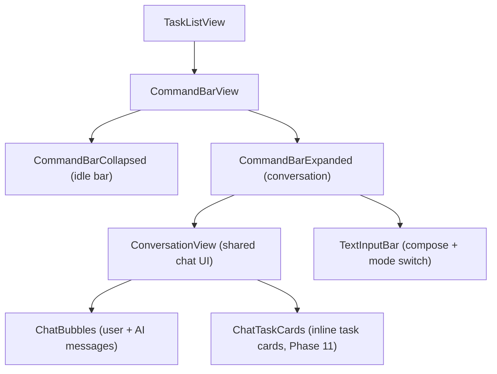

# Unified AI Command Bar

One input, three modes (voice, text, +), same conversation backend. Replaces search, toolbar mic, and toolbar "+" with a single bottom-positioned command bar that expands into the full conversation view.

_Created: 2026-02_

---

## Overview

The **Unified AI Command Bar** (user-facing: "Ask Docket") is Docket's primary interaction surface. Users type or speak to create tasks, find tasks, or ask the AI anything. The bar lives at the bottom of the task list, expands gracefully into a full conversation view on submit (text) or mic tap (voice), and supports mid-conversation switching between voice and text.

**Design philosophy:**

- One entry point — no separate mic button, no separate "+" in toolbar
- Search is separate — toolbar magnifying glass toggles `.searchable`; command bar has its own internal text (decoupled)
- Same `parse-voice-tasks` Edge Function for both text and voice input
- Conversation view is shared — chat bubbles, ChatTaskCard for confirmation, follow-up flow identical

---

## UX Lifecycle

### Idle State

```
┌─────────────────────────────────────────────────────────────┐
│  Task list (scrollable)                                     │
│  ...                                                        │
│                                                             │
├─────────────────────────────────────────────────────────────┤
│  [ (+) ]  "Ask Docket anything..."              [ ||||| ]   │
└─────────────────────────────────────────────────────────────┘
```

- **(+)** on left: tap opens AddTaskView; long-press for context menu ("Manual Task", "Attach Picture")
- Placeholder centered: "Ask Docket anything..."
- **5-bars icon** on right: tap for voice mode (replaces submit arrow when field is empty)
- Bottom-positioned, persistent in TaskListView via `.safeAreaInset(edge: .bottom)`
- Toolbar above task list: filter, search (magnifying glass), bell, profile only (no mic, no +)

### Text Mode (Tap Field)

```
┌─────────────────────────────────────────────────────────────┐
│  Task list                                                   │
│  (Search: pull down from nav bar or tap magnifying glass)   │
│  ...                                                        │
├─────────────────────────────────────────────────────────────┤
│  [ (+) ]  "grocery |"               [ ||||| ]  [ ↑ ]        │
│  (Command bar text is separate from search)                  │
└─────────────────────────────────────────────────────────────┘
```

- Search: `.searchable` modifier on NavigationStack — pull down or tap magnifying glass
- Command bar has its own internal text state (decoupled from search)
- Keyboard rises, 5-bars morphs to submit arrow when field has text
- Field grows vertically like iMessage for multi-line input

### Submit (Conversation Expands)

```
┌─────────────────────────────────────────────────────────────┐
│  You: "add grocery run to Costco tomorrow"                   │
│                                                             │
│  Docket: "Got it — grocery run at Costco tomorrow. I see     │
│           you have a Costco template with 12 items. Want     │
│           me to use it?"                                     │
│                                                             │
├─────────────────────────────────────────────────────────────┤
│  [ (+) ]  "Type a reply..."                     [ ↑ ] [ ||||| ] │
└─────────────────────────────────────────────────────────────┘
```

- Full conversation view grows upward from the bar
- User's text becomes first chat bubble (shared ID scheme prevents flicker — same pattern as voice)
- AI response appears as reply bubble
- Same conversation UI as VoiceRecordingView
- **No TTS in text mode** — text bubbles only
- High confidence: auto-save + QuickAcceptToast, bar collapses
- Medium/low confidence: conversation expands with ChatTaskCard (Add/Edit/Cancel); user can type follow-ups to refine before confirming
- Voice icon (5-bars) available mid-conversation — user can switch to voice

### Voice Mode (Tap 5-Bars)

- Opens VoiceRecordingView sheet; **recording auto-starts** immediately after permissions (no second tap)
- Mic active, TTS active, full conversation loop
- All existing VoiceRecordingView behavior preserved (see [VOICE-TO-TASK-V2.md](../../VOICE-TO-TASK-V2.md))
- User can switch to typing mid-conversation (and vice versa)
- Text input bar available at bottom of expanded view

### "+" Context Menu (Long-Press)

- **Manual Task** — opens full AddTaskView sheet (structured form)
- **Attach Picture** — camera mode + photo album access (future phase)

---

## View Architecture



- Extract shared conversation UI from current `VoiceRecordingView` into `ConversationView`
- `CommandBarView` manages expansion state (collapsed / text-active / expanded / voice-active)
- `VoiceRecordingView` deprecated as standalone sheet — logic absorbed into `CommandBarView`
- State machine: `idle` → `textInput` (field focused) → `expanded` (text submit) or `voiceActive` (mic tap)

---

## What Gets Deprecated

| Item                                               | Replacement                                                  |
| -------------------------------------------------- | ------------------------------------------------------------ |
| SearchBar in toolbar                               | `.searchable` modifier on NavigationStack (pull-down search) |
| Mic toolbar button (`showingVoiceRecording`)       | 5-bars icon in CommandBar                                    |
| "+" toolbar button (`showingAddTask` from toolbar) | "+" tap opens AddTaskView; long-press context menu           |
| InlineConfirmationBar, InlineTaskEditView          | ChatTaskCard in conversation view                            |
| VoiceRecordingView as standalone `.sheet`          | CommandBar expanded state (voice mode)                       |
| Toolbar: filter, bell, profile, mic, +             | Toolbar: filter, search, bell, profile                       |

---

## Backend Impact

**Zero backend changes.** Same `parse-voice-tasks` Edge Function for both text and voice.

- Text mode: skip transcription, send typed text directly as `messages[]` array
- Same ParsedTask, ParseResponse, TaskContext, TaskChanges models
- Same IntentClassifier for local intent detection (dismiss, thanks, confirm, etc.)
- Edge Function is stateless — receives messages, returns response. Input source is irrelevant.

---

## Keyboard + Safe Area Handling

- Bottom bar above home indicator when idle (`.safeAreaInset(edge: .bottom)`)
- Rises with keyboard using `keyboardLayoutGuide` or equivalent
- **Risk:** iPhone SE / smaller devices — ensure field doesn't obscure too much task list. Test on smallest supported device.
- Expansion animation must respect safe areas at top and bottom
- Dismiss: swipe down or tap outside to collapse back to bar

---

## Search Behavior

- Search is **separate** from command bar — `.searchable` on NavigationStack
- Tap magnifying glass or pull down to reveal search field
- Command bar text is internal state only — used for AI input, not filtering
- Search filters tasks by title; command bar sends to AI

---

## Design Decisions Locked

| Decision          | Choice                                                                  |
| ----------------- | ----------------------------------------------------------------------- |
| Internal name     | "Unified AI Command Bar"                                                |
| User-facing name  | "Ask Docket"                                                            |
| Search            | `.searchable` on nav bar; decoupled from command bar                    |
| Expansion trigger | Submit button (not word count)                                          |
| 5-bars vs submit  | One position, two states — 5-bars when empty, submit when text present  |
| "+" interaction   | Tap opens AddTaskView; long-press context menu                          |
| TTS in text mode  | No — text bubbles only                                                  |
| High confidence   | Auto-save + QuickAcceptToast; medium/low → ChatTaskCard in conversation |
| Mode switching    | Voice ↔ text supported mid-conversation                                 |
| Message array     | Same `messages[]` for both modes                                        |

---

## Recent Updates (2026-02-14)

- **Expanded sheet title:** "Ask Docket" (was "Task Assistant")
- **Voice auto-start:** Recording starts automatically when voice sheet opens (see [VOICE_UX_IMPROVEMENTS_2026-02-14.md](VOICE_UX_IMPROVEMENTS_2026-02-14.md))

---

## Cross-References

- **Voice architecture:** [VOICE-TO-TASK-V2.md](../../VOICE-TO-TASK-V2.md)
- **Implementation tasks:** [TODO.md](TODO.md) § Phase 13
- **Product roadmap:** [PRODUCT-ROADMAP.md](PRODUCT-ROADMAP.md)
- **Onboarding:** [TUTORIALS.md](TUTORIALS.md) § T11–T14
