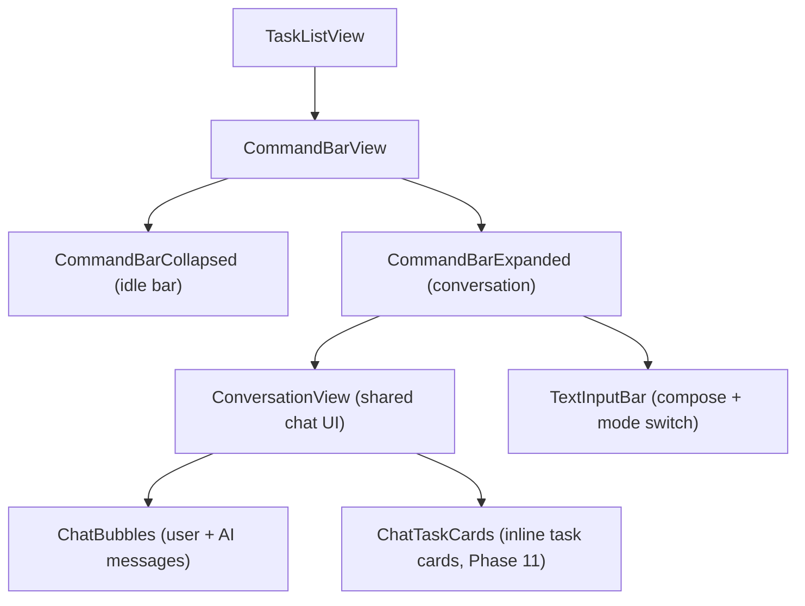

# Unified AI Command Bar

One input, three modes (voice, text, +), same conversation backend. Replaces search, toolbar mic, and toolbar "+" with a single bottom-positioned command bar that expands into the full conversation view.

*Created: 2026-02*

---

## Overview

The **Unified AI Command Bar** (user-facing: "Ask Docket") is Docket's primary interaction surface. Users type or speak to create tasks, find tasks, or ask the AI anything. The bar lives at the bottom of the task list, expands gracefully into a full conversation view on submit (text) or mic tap (voice), and supports mid-conversation switching between voice and text.

**Design philosophy:**
- One entry point — no separate mic button, no separate "+" in toolbar
- Search is implicit in text mode — tasks filter live as you type (always-on, no toggle)
- Same `parse-voice-tasks` Edge Function for both text and voice input
- Conversation view is shared — chat bubbles, task cards, follow-up flow identical

---

## UX Lifecycle

### Idle State

```
┌─────────────────────────────────────────────────────────────┐
│  Task list (scrollable)                                     │
│  ...                                                        │
│                                                             │
├─────────────────────────────────────────────────────────────┤
│  [ (+) ]  "Ask Docket anything..."              [ ||||| ]   │
└─────────────────────────────────────────────────────────────┘
```

- **(+)** on left: long-press for context menu ("Manual Task", "Attach Picture")
- Placeholder centered: "Ask Docket anything..."
- **5-bars icon** on right: tap for voice mode (replaces submit arrow when field is empty)
- Bottom-positioned, persistent in TaskListView via `.safeAreaInset(edge: .bottom)`
- Toolbar above task list: filter, bell, profile only (no mic, no +)

### Text Mode (Tap Field)

```
┌─────────────────────────────────────────────────────────────┐
│  Task list — filtered live as user types                     │
│  (single-line: results prominent; multi-line: results dim)   │
│  ...                                                        │
├─────────────────────────────────────────────────────────────┤
│  [ (+) ]  "grocery |"               [ 🔍 ]  [ ↑ ]          │
│  (iOS dictation mic appears in keyboard — standard, small)   │
└─────────────────────────────────────────────────────────────┘
```

- Keyboard rises, 5-bars morphs to submit arrow (crossfade ~0.2s)
- Magnifying glass indicator appears (blue = filtering active, auto-on)
- Tasks filter live in background as user types
- Field grows vertically like iMessage for multi-line input
- Single-line: filtered results prominent behind
- Multi-line: filtered results fade, submit button emphasized

### Submit (Conversation Expands)

```
┌─────────────────────────────────────────────────────────────┐
│  You: "add grocery run to Costco tomorrow"                   │
│                                                             │
│  Docket: "Got it — grocery run at Costco tomorrow. I see     │
│           you have a Costco template with 12 items. Want     │
│           me to use it?"                                     │
│                                                             │
├─────────────────────────────────────────────────────────────┤
│  [ (+) ]  "Type a reply..."                     [ ↑ ] [ ||||| ] │
└─────────────────────────────────────────────────────────────┘
```

- Full conversation view grows upward from the bar
- User's text becomes first chat bubble (shared ID scheme prevents flicker — same pattern as voice)
- AI response appears as reply bubble
- Same conversation UI as VoiceRecordingView
- **No TTS in text mode** — text bubbles only
- One-shot completions (`type: "complete"` on first turn): auto-collapse with success toast + haptic
- Multi-turn: conversation stays open, input bar at bottom for follow-up
- Voice icon (5-bars) available mid-conversation — user can switch to voice

### Voice Mode (Tap 5-Bars)

- Same full expansion into conversation view
- Mic active, TTS active, full conversation loop
- All existing VoiceRecordingView behavior preserved (see [VOICE-TO-TASK-V2.md](VOICE-TO-TASK-V2.md))
- User can switch to typing mid-conversation (and vice versa)
- Text input bar available at bottom of expanded view

### "+" Context Menu (Long-Press)

- **Manual Task** — opens full AddTaskView sheet (structured form)
- **Attach Picture** — camera mode + photo album access (future phase)

---

## View Architecture



- Extract shared conversation UI from current `VoiceRecordingView` into `ConversationView`
- `CommandBarView` manages expansion state (collapsed / text-active / expanded / voice-active)
- `VoiceRecordingView` deprecated as standalone sheet — logic absorbed into `CommandBarView`
- State machine: `idle` → `textInput` (field focused) → `expanded` (text submit) or `voiceActive` (mic tap)

---

## What Gets Deprecated

| Item | Replacement |
|------|-------------|
| `.searchable` modifier on TaskListView | Live filtering in CommandBar text mode |
| Mic toolbar button (`showingVoiceRecording`) | 5-bars icon in CommandBar |
| "+" toolbar button (`showingAddTask` from toolbar) | "+" long-press context menu in CommandBar |
| VoiceRecordingView as standalone `.sheet` | CommandBar expanded state (voice mode) |
| Toolbar: filter, bell, profile, mic, + | Toolbar: filter, bell, profile only |

---

## Backend Impact

**Zero backend changes.** Same `parse-voice-tasks` Edge Function for both text and voice.

- Text mode: skip transcription, send typed text directly as `messages[]` array
- Same ParsedTask, ParseResponse, TaskContext, TaskChanges models
- Same IntentClassifier for local intent detection (dismiss, thanks, confirm, etc.)
- Edge Function is stateless — receives messages, returns response. Input source is irrelevant.

---

## Keyboard + Safe Area Handling

- Bottom bar above home indicator when idle (`.safeAreaInset(edge: .bottom)`)
- Rises with keyboard using `keyboardLayoutGuide` or equivalent
- **Risk:** iPhone SE / smaller devices — ensure field doesn't obscure too much task list. Test on smallest supported device.
- Expansion animation must respect safe areas at top and bottom
- Dismiss: swipe down or tap outside to collapse back to bar

---

## Search Behavior

- Filtering is **always-on** when typing (no toggle)
- Magnifying glass indicator lights blue to show active filtering
- Single-line input: filtered results prominent behind
- Multi-line input: filtered results fade, submit button emphasized
- **Pull-down within expanded conversation:** search through chat history (filter chat bubbles by text)

---

## Design Decisions Locked

| Decision | Choice |
|----------|--------|
| Internal name | "Unified AI Command Bar" |
| User-facing name | "Ask Docket" |
| Search | Implicit in text mode, always-on, no toggle |
| Expansion trigger | Submit button (not word count) |
| 5-bars vs submit | One position, two states — 5-bars when empty, submit when text present |
| "+" interaction | Long-press context menu |
| TTS in text mode | No — text bubbles only |
| One-shot completions | Auto-collapse with success toast + haptic |
| Mode switching | Voice ↔ text supported mid-conversation |
| Message array | Same `messages[]` for both modes |

---

## Cross-References

- **Voice architecture:** [VOICE-TO-TASK-V2.md](VOICE-TO-TASK-V2.md)
- **Implementation tasks:** [TODO.md](TODO.md) § Phase 13
- **Product roadmap:** [PRODUCT-ROADMAP.md](PRODUCT-ROADMAP.md)
- **Onboarding:** [TUTORIALS.md](TUTORIALS.md) § T11–T14
